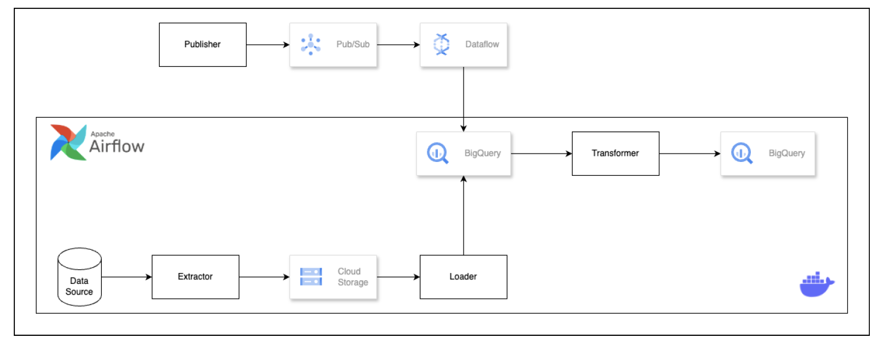

# Taxi Data ELT & Streaming Pipeline Project

This project implements a full data engineering workflow to process data using ELT (Extract, Load, Transform) and real-time streaming pipelines.

---

## Project Goals

### Batch Pipeline (ELT)
- Transfer taxi trip data from a local source to BigQuery via GCS staging.
- **GCS Staging Bucket:**
- **BigQuery Dataset (Staging & Mart):** 
- Use Airflow as a daily scheduler to orchestrate extractor, loader, and transformer tasks.
- Leverage scripts (extractor, loader, transformer) using Airflow Operators.
- Partition and incrementally load taxi data in BigQuery.

### Streaming Pipeline
- Stream simulated taxi trip data in real time using:
  - **Pub/Sub** for messaging
  - **Dataflow** for (optional) real-time transformation
  - **BigQuery** for real-time data warehousing
- A custom Python script simulates and publishes the data.

---

## Project Structure

```bash
├── airflow/                   # All DAGs and Airflow-related code
│   ├── dags/
│   │   └── my_etl_dag.py
│   ├── plugins/
│   ├── Dockerfile
│   └── requirements.txt       # Python dependencies for Airflow
│
├── config/
│   ├── key.json                   # GCP service account JSON key
│
├── data/                      # Raw/local taxi trip data for batch load
│   └── source_data.csv
│
├── gcs/                       # GCS interaction utilities
│   ├── upload_to_gcs.py
│
├── dbt/                       # dbt project for transformation
│   ├── dbt_project.yml
│   ├── models/
│   │   └── transform.sql
│   └── profiles.yml
│
├── docker-compose.yml         # Docker setup for Airflow
└── README.md
```

---

## Architecture Overview



---

## How to Run

### Batch (ELT) Pipeline

1. **Start Build Docker**
   ```bash
   docker-compose build
   ```

2. **Start Airflow with Docker**
   ```bash
   docker-compose up -d
   ```

3. **Trigger DAG**
   - Open Airflow UI at `http://localhost:8080`
   - Trigger `my_etl_dag`

---

### Streaming Pipeline

1. **Create Virtual Environment & Install Dependencies**
   ```bash
   cd streaming/
   python -m venv venv
   source venv/bin/activate 
   pip install apache-beam[gcp] google-cloud-pubsub 
   ```
2. **Start ApacheBeam**
   ```bash
   python beam-pipeline-taxi.py
   ```

3. **Start Publisher**
   ```bash
   python publisher_taxi.py
   ```
---

### Notes
- Ensure GCP credentials are stored securely in `config/`.
- Rename or make new folder inside `source/csv` and `source/json` based on date you run the program ex: `source/csv/2025-05-30`
- Airflow is portable via Docker but may also be installed via other methods.
- Use partitioning and incremental loading in BigQuery for optimized storage and query performance.

---
